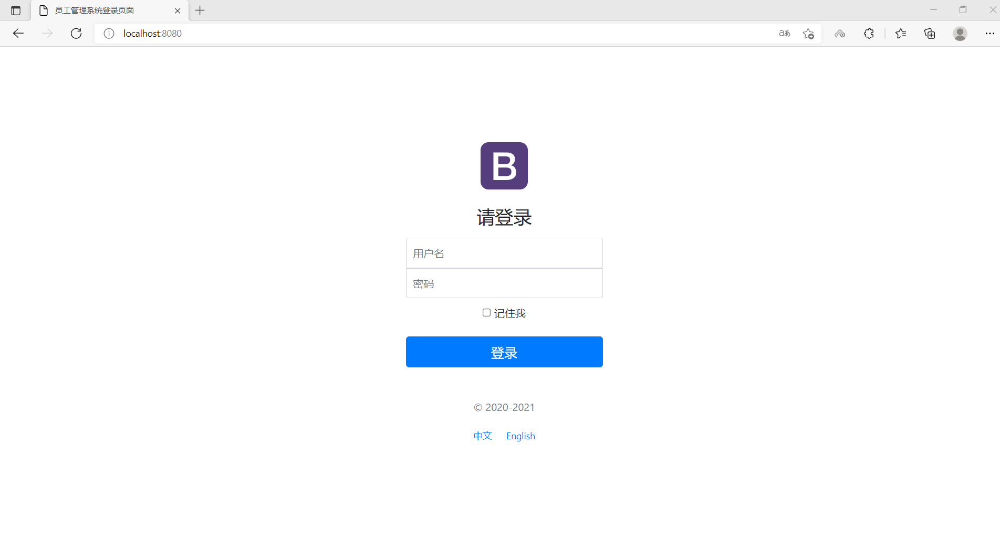
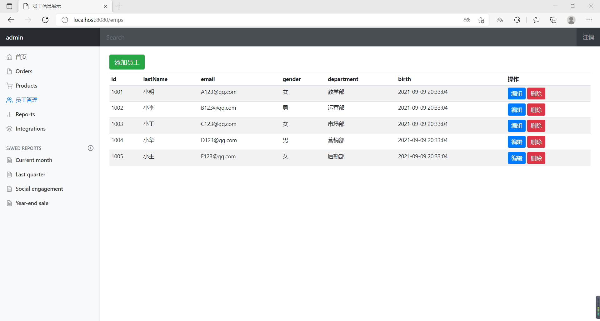

## 一个简单的员工管理系统（尚未连接数据库）

### 1. 首页配置

- 所有页面的静态资源都使用thymeleaf（一种用来开发Web和独立环境项目的服务器端的Java模版引擎）接管
- thymeleaf中url的读取方式：`@{}`
- thymeleaf中变量及表达式的读取方式：`${}`

### 2. 页面国际化

- 首先需要配置i18n（internationalization）文件

- 为了在项目中实现点击按钮切换登录界面的中英文，自定义一个组件 `MyLocaleResolver`
- 将自己写的组件配置到spring容器 `@Bean`
- thymeleaf中消息的读取方式：`#{}`

### 3. 登录拦截器
- 利用HttpSession创建一个session，登陆成功时`session.setAttribute`来添加一个参数
- 在自定义的实现了`HandlerInterceptor`接口的拦截器中，判断参数是否为空（即判断是否成功登陆），为空则不允许通过
- 将自己写的拦截器配置到spring容器，`@Override`方法`addInterceptors`

### 4. 员工列表展示
- 提取公共页面
    - `th:fragment="sidebar"`
    - `th:replace="~{commons/common::sidebar}"`
    - 如果要传递参数，可以直接使用()传参，接收判断即可
- 列表循环展示：`th:each="emp:${emps}"`
- 员工展示页面`emp/list.html`

### 5. 添加员工
- 按钮提交，绑定接口`th:href="@{/emp}"`
- 跳转到添加页面，`/emp`接口（get方法）绑定emp/add.html，同时通过Model向前端传递departments信息
- 添加员工，前端数据通过`name`属性封装成employee类
- 点击添加按钮，通过`/emp`接口（post方法），把封装好的employee类返回给`employeeDao`，最后返回员工展示页面`list.html`

### 6. 修改员工信息
- 编写接口`/emp/{id}`，其中id为要删除的员工id，可通过在list.html中的编辑按钮中使用`th:href="@{'/emp/'+${emp.getId()}}"`获取
- 修改页面需要保存先前的员工信息，在update.html中使用`th:value`显示
- 修改完成后返回list.html

### 7. 删除员工信息及404处理
- 删除员工只需要增加一个`/delemp/{id}`接口，调用`employeeDao.removeEmployee`
- Springboot中404处理十分方便，只需要新建一个error文件夹，把404.html放入其中即可，其他500等错误提示操作类似

## 界面效果展示

---

